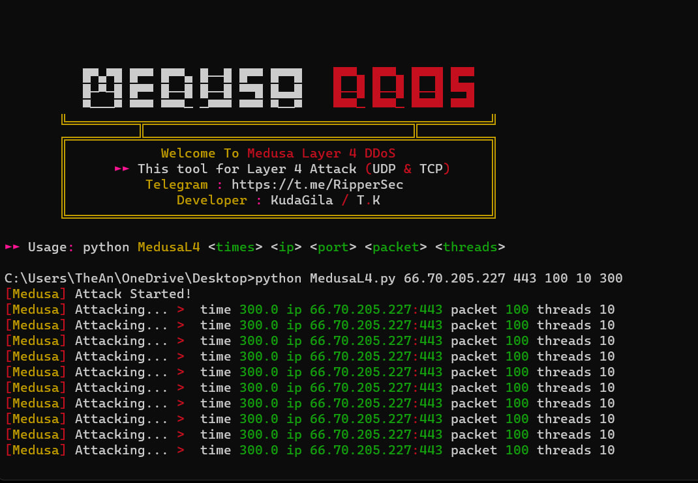
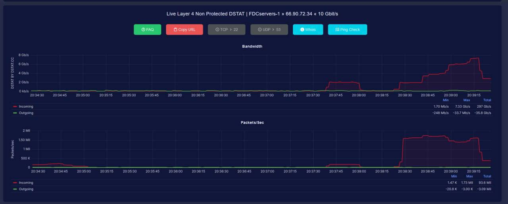

# Medusa Layer-4 DDoS Tool
 ### About :
- This DDoS tool attack using ip address (tcp & udp)
 ### Refference :
- Telegram : https://t.me/RipperSec

 ## Usage :

```
Usage: python3 MedusaL4.py <ip> <port> <packet> <threads> <times>
````

## Tool Display :


## Power Proof :


## Donation :

https://sociabuzz.com/kudagila/donate


## Disclaimer :
This tool only for Education, Pentesting, and Research Purposes!
